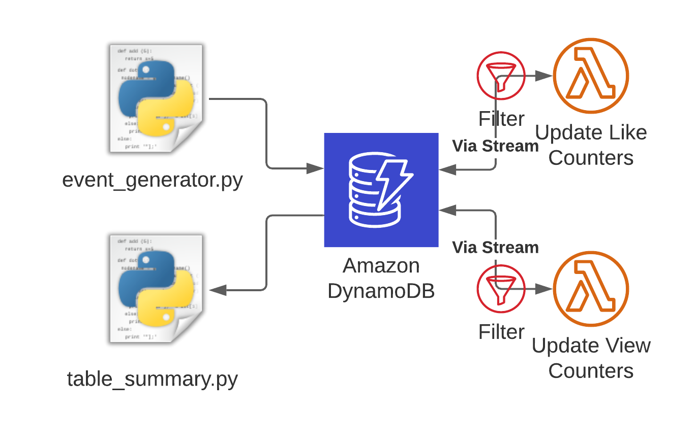
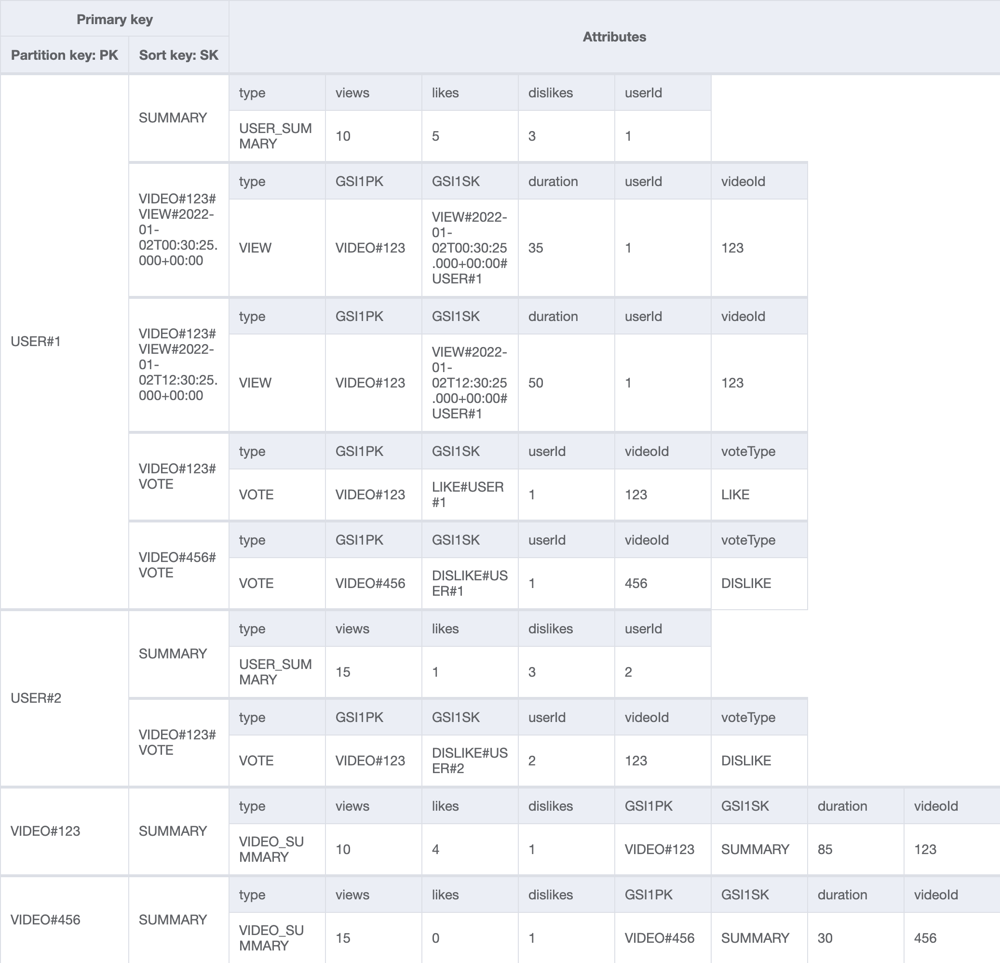
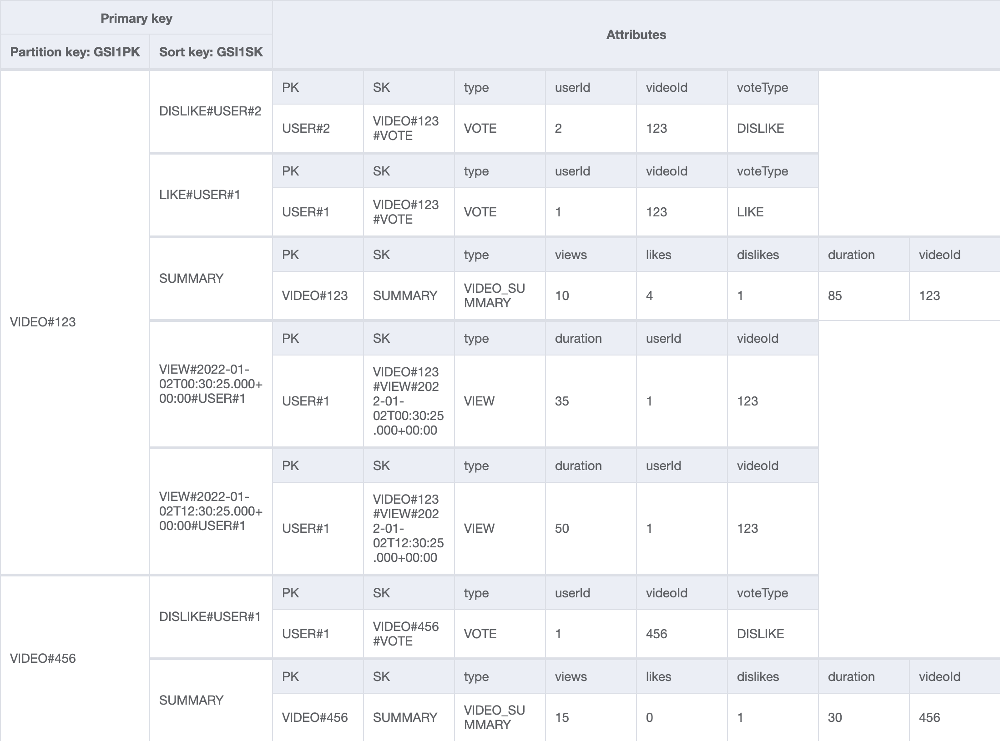

# DynamoDB-Streams Lambda Filter Demo

This project is used to demo the usage of event filters for DynamoDB streams in front of AWS Lambda.

It is modelled after a video platform where users can view videos and can also like or dislike them.
The idea is to have an event stream of `VIEW` and `VOTE` events that are written to DynamoDB.
The user interface is only interested in the aggregates of the views and votes for each user or video.

Computing this on the fly would be very expensive, that's why we're using summary items.
The summary item holds the aggregates of likes, dislikes, views and view-minutes per user and per video.
Summary items are created and/or updated via Lambda functions that are attached to the DynamoDB stream.

Recently AWS launched the ability to filter events in the stream before they hit your Lambda functions.
This makes it possible to reduce the number of Lambda invocations.
We're using that here to have one Lambda only respond to `VIEW` items and another only to `VOTE` items.

## Architecture

The architecture visualizes what is described above.
In addition to the AWS components there are also two Python scripts visible.
The `event_generator.py` generates both `VIEW` as well as `VOTE` events and adds them to the database.
The `table_summary.py` script on the other hand periodically queries and visualizes the summary items for the users and videos so we can see what's going on.



Let's take a look at the data model of the table before we run the code.
I'm following the single table design here and in the base table we can see that there are four kinds of entities:



- `USER_SUMMARY` summarizes the likes, dislikes, views and total view duration per user
- `VIEW` is a single view of a video by a user for a certain duration
- `VOTE` is either a like or dislike by a user for a video
- `VIDEO_SUMMARY` summarizes the likes, dislikes, views and total view duration per video

There is also a global secondary index (GSI1) that makes it possible to query for information for a given video:



Now that we've seen what's in the database, let's run some code!

## Prerequisites

- Python version >= 3.6
- CDK version >= 2.3


## Setup

1. Clone the repository and navigate to this directory
2. Create a virtual environment

```
$ python3 -m venv .venv
```

3. Activate the virtual environment

```
$ source .venv/bin/activate
```

If you are a Windows platform, you would activate the virtualenv like this:

```
% .venv\Scripts\activate.bat
```

4. Once the virtualenv is activated, you can install the required dependencies.

```
$ pip install -r requirements.txt
```

5. At this point you can now deploy the resources to AWS

```
$ cdk deploy
```

## Run the code

I suggest you create two terminals to see what's going on.

In Terminal 1 you can run the table summary script that allows you to see what's going on in the table. It will automatically refresh the data every 15 seconds. This is what it looks like in the beginning.

```shell
$ python3 table_summary.py

|----------+----------+----------+----------+----------|
|videoId   |views     |duration  |likes     |dislikes  |
|----------+----------+----------+----------+----------|
Fetched at 2022-01-02T16:52:55


|----------+----------+----------+----------+----------|
|userId    |views     |duration  |likes     |dislikes  |
|----------+----------+----------+----------+----------|
Fetched at 2022-01-02T16:52:55

xxxxxxxxxxxxxxxxxxxxxxxxxxxxxxxxxxxxxxxxxxxxxxxxxxxxxxxx
```

In Terminal 2 you can start the other script, which will create events and store them in DynamoDB. It randomizes user ids and video ids, feel free to stop it whenever you think there are enough events.

```shell
$ python3 event_generator.py
USER 0 likes VIDEO 5
USER 0 watches VIDEO 6
USER 2 watches VIDEO 2
USER 3 watches VIDEO 3
USER 4 dislikes VIDEO 9
USER 0 watches VIDEO 4
USER 0 likes VIDEO 8
```

In Terminal 1 you should now see things changing.
Summaries will appear for both users and videos and you can observe that the system works.

```shell
|----------+----------+----------+----------+----------|
|videoId   |views     |duration  |likes     |dislikes  |
|----------+----------+----------+----------+----------|
|0         |44        |3389      |5         |1         |
|----------+----------+----------+----------+----------|
|1         |40        |2985      |4         |2         |
|----------+----------+----------+----------+----------|
|2         |40        |3280      |4         |3         |
|----------+----------+----------+----------+----------|
# [...]
|----------+----------+----------+----------+----------|
|9         |41        |3000      |3         |2         |
|----------+----------+----------+----------+----------|
Fetched at 2022-01-02T17:05:29


|----------+----------+----------+----------+----------|
|userId    |views     |duration  |likes     |dislikes  |
|----------+----------+----------+----------+----------|
|0         |83        |6193      |9         |2         |
|----------+----------+----------+----------+----------|
|1         |85        |6002      |5         |6         |
|----------+----------+----------+----------+----------|
|2         |96        |7502      |9         |2         |
|----------+----------+----------+----------+----------|
|3         |71        |5283      |8         |4         |
|----------+----------+----------+----------+----------|
|4         |88        |7009      |6         |7         |
|----------+----------+----------+----------+----------|
Fetched at 2022-01-02T17:05:29

xxxxxxxxxxxxxxxxxxxxxxxxxxxxxxxxxxxxxxxxxxxxxxxxxxxxxxxx
```

Neat, right?
Let's see how these filters work.
They're implemented in `lambda_filters/lambda_filters_stack.py`.

```python
# Filters aren't yet (CDK v2.3.0) supported for DynamoDB, we have to
# go to the low level CFN stuff here
_lambda.CfnEventSourceMapping(
    self,
    id="update-view-counters-event-source",
    function_name=update_view_counters_lambda.function_name,
    event_source_arn=data_table.table_stream_arn,
    starting_position="LATEST",
    batch_size=1,
    filter_criteria={
        "Filters": [
            {
                "Pattern": json.dumps({
                    # Only capture view events here
                    "dynamodb": {"NewImage": {"type": {"S": ["VIEW"]}}},  
                    "eventName": ["INSERT","REMOVE"],
                })
            }
        ]
    }
)
```

As you can see we're using a L1-construct (Low-level CloudFormation abstraction), because higher level constructs aren't yet available at the time of writing this.
We connect the Stream to the Lambda function and then set up a filter.
The filter has two criteria that are AND-connected.
For events to pass the filter they need to have an event name equal to `INSERT` or `REMOVE` and the `dynamodb.NewImage.type.S` attribute needs to have the value `VIEW`.

More complex filter rules are possible as described in the [documentation](https://docs.aws.amazon.com/lambda/latest/dg/invocation-eventfiltering.html#filtering-syntax), but this is sufficient for our use case.

That's it!
Feel free to check out the code if you're interested:

```terminal
├── README.md
├── app.py
├── cdk.json
├── constants.py
├── doc
│   ├── ddb_filter_architecture.png
│   ├── filter_demo_base_table.png
│   └── filter_demo_gsi1.png
├── event_generator.py # Creates video events
├── lambda_filters # Infrastructure Code
│   ├── __init__.py
│   └── lambda_filters_stack.py
├── requirements.txt
├── source.bat
├── src # Code for the Lambda functions
│   ├── update_like_counters.py
│   └── update_view_counters.py
└── table_summary.py # Visualizes summary items
```