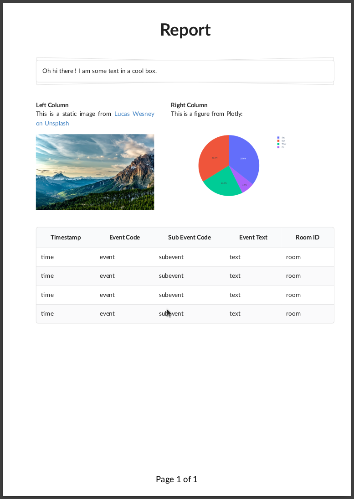

# PDF-Reports Demo

This repo creates a pdf with a data table, static images and plots using the pdf-reports python library.

Steps:

1. Create a venv: `python3 -m venv .venv`
2. Activate it: `source .venv/bin/activate`
3. Install dependencies: `pip install -r requirements.txt`
4. Render the PDF: `python3 render.py`

References:

- https://github.com/Edinburgh-Genome-Foundry/pdf_reports