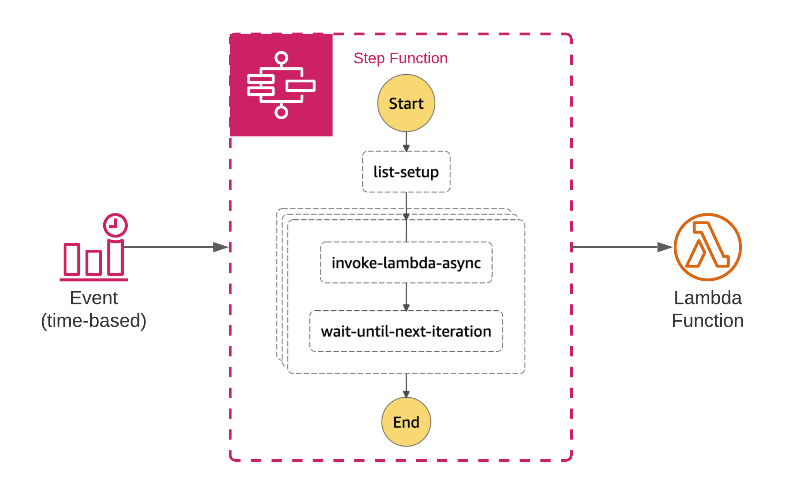

# Sub Minute Lambda Trigger

This is a demo project to show how you can use step functions to invoke lambda functions in intervals lower than a minute.

It deploys and architecture like this:



A CloudWatch events trigger runs a state machine every minute. The state machine is then responsible for triggering the lambda function in the intervals specified. The construct that implements this functionality verifies that the interval "neatly" fits into a minute, i.e. 60 is evenly divisible by it.

There is no guarantee that the interval will be accurate, but since the lambda function will be invoked asynchronously, it should be fairly accurate.

You can use the `SubMinuteLambdaTrigger` construct like this:

```python
# Create SubMinuteLambdaTrigger with Lambda Function and interval
SubMinuteLambdaTrigger(
    self,
    "sub-minute-trigger",
    interval=10,
    lambda_function=lambda_function
)
```

The code for the construct is in `sub_minute_lambda_trigger/infrastructure.py`.