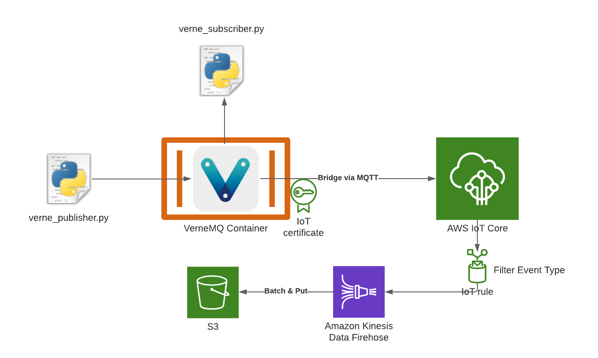

# VerneMQ to IoT Core to S3 POC

Small POC to test a Bridge between VerneMQ and AWS IoT Core so all messages in Verne are replicated to AWS.
These messages are then filtered through an IoT Rule and sent to Kinesis Data Firehose where they're batched and eventually stored in S3.



## Prerequisites

- Docker
- Docker-compose
- Terraform
- Python

## Setup

Deploy the Terraform app, it will fetch the iot core endpoint and create a certificate with permissions to publish and subscribe to everything. Also it sets up the Kinesis data firehose, S3 bucket, IoT Rule and required permissions.

```shell
terraform apply
```

In the output you'll see the `iot_endpoint` for your account, note that down.

```text
[...]
Outputs:

cert_pem = <sensitive>
cert_private_key = <sensitive>
cert_public_key = <sensitive>
iot_endpoint = "a1vs2yekzasdfv1-ats.iot.eu-central-1.amazonaws.com"
```

Edit the `docker-compose.yml` and replace the values in the environment variable `DOCKER_VERNEMQ_VMQ_BRIDGE.ssl.sbr0` with your `iot_endpoint`.

Run the following command to output the certificate information in the `local/ssl/` folder. The content is on the `.gitignore`, it's sensitive.
These will be used by Verne MQ to push data to AWS.

```shell
wget https://www.amazontrust.com/repository/AmazonRootCA1.pem -P local/ssl/
terraform output -raw cert_pem > local/ssl/cert.pem
terraform output -raw cert_public_key > local/ssl/cert.pub
terraform output -raw cert_private_key > local/ssl/cert.private
```

Next, create a new Python Virtual environment, activate it and install the dependencies:

```shell
python3 -m venv .venv
source .venv/bin/activate
pip install -r requirements.txt
```

This covers the prerequisites, we can now start VerneMQ using: `docker-compose up`.

Next we start our local publisher:

```shell
python verne_publisher.py
```

We should see events being published to VerneMQ, which we can verify by starting our subscriber:

```shell
python verne_subscriber.py
```